### word2vec

- 结构

  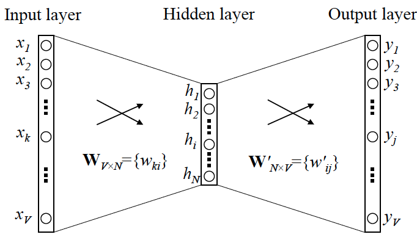

- 使用word2vec时，输入的是词，中文需要先分词，英文不需要

- 分为两种
  - skip-gram：中心词预测上下文词
  - cbow（bag of word）：上下文词预测中心词

- 缺点：
  - 仅考虑了一定小范围的上下文，而不是整个上下文
  - 没有考虑到远处的词，但有可能和远处的词是相关的
  - 没法解决一词多义的问题，即是每个词的词向量都是静态的，不随上下文改变的

#### 两种使用方式

- 可以生成自定义数据的词向量：单独使用gensim库中的word2vec
- 使用预训练的词向量(如在keras中)：包含了很多词及其词向量
  - [glove](https://nlp.stanford.edu/projects/glove )，是2014 年英文维基百科的预计算嵌入，包含了400 000 个单词（或非单词的标记）的100 维嵌入向量
  - word2vec同理


#### 优化

hierarchical softmax

- 解决softmax计算量大的问题
- 缺点：很生僻的词，那么就需要沿着huffman树往下走很多 
- 参考：[word2vec 中的数学原理详解](https://www.cnblogs.com/peghoty/p/3857839.html)

negative sampling

- 负采样，根据词频构建负样本
- 目标函数变成：max p(正)*[1-p(负)]
- 与（0，1）做交叉熵
- 参考：[word2vec中对于Negative Sampling的理解](https://blog.csdn.net/u010995990/article/details/79820146 )


#### keras-embedding对比

keras中使用预训练的词向量（IMDB评论情感分类任务）

- 与word2vec比较：
  - word2vec是非监督获取到词向量
  - keras的embedding层是根据任务标签获取的到权重，即是监督学习获取
  - 参考：[Keras中的Embedding和Word2vec的区别](https://blog.csdn.net/weixin_39963132/article/details/85332134 )
- 下载到词向量数据后，构建权重矩阵(总单词数 x 目标维数)，矩阵中每i行即对应第i个单词
- 建好模型，设置embedding的权重为所上面构造的矩阵，且冻结embedding层
- 将embedding层的输出当作模型的"输入"，仅调整后面层的参数


参考：

- 下面这两篇都很完整，很值得阅读	
- [word2vec原理(一) CBOW与Skip-Gram模型基础](https://www.cnblogs.com/pinard/p/7160330.html)
- [word2vec 中的数学原理详解](https://www.cnblogs.com/peghoty/p/3857839.html)


关于使用预训练模型(也叫迁移学习)

- 原因：往往是因为数据量太少，不容易学到比较底层的特征，这是就可以使用其他已经在大数据集上训练好的特征表示，用作当前模型的low layer，而仅关注于特定任务的上层表示学习
- 冻结，因为随机初始化的层会引起较大的梯度更新，会破坏已经学到的特征。
- 微调，fine-turning


#### 解决word2vec问题的思考

- dense，考虑的是全部的上下文信息，但是句子的顺序信息没有了，而句子之所以是句子，就是将一些词安装顺序进行排序（不太可行）
- cnn，如TextCNN，mask掉需要预测的词，然后预测（可以尝试）
- rnn，双向的，通过memory来保存上文或下文信息


### [FastText](https://github.com/facebookresearch/fastText )（2016.08）

#### 概述

- 最简单的文本分类模型

- 结构：CBOW前半部分 + DNN

- 与word2vec对比：

  - word2vec是基于语言模型的，即无监督学习，学到的是词频，包括上下文（n-gram）
  - fasttext是基于标签的，即有监督模型，学到的词向量是是和任务相关

- 引入subword，即考虑到词内部关联（对于中文没用，无法对词再拆分）

  - dog和dogs在word2vec中不同，但应该很相近才最
  - 可解决 word2vec 没能解决的 OOV（Out-Of-Vocabulary）问题
  - 将where按照n-gram的方式拆分获取到：“<wh”，“whe”，“her”，“ ere”，“ re>” 
  - 词向量=子词向量+词向量

- 网络结构

  - embedding
  - 句子中各词向量相加求平均
  - 最后使用softmax 或 Hierarchical softmax，具体试类别数量决定 

  

- 


### DNN

#### 概述

- 输入one-hot，不进行embedding，直接接全连接层，最后获取结果

- 网络结构

  ```python
  model = models.Sequential()
  model.add(layers.Dense(16, activation='relu', input_shape=(10000,)))
  model.add(layers.Dense(16, activation='relu'))
  model.add(layers.Dense(1, activation='sigmoid'))
  ```

- 特点：
  - 简单粗暴
  - 分类效果也不错

- 如keras中的案例：
  - 评分情感分类、新闻分类
  - 输入是one-hot


### TextCNN（2014.09）

#### 概述

- 用处理图像的方式来处理文本序列

- 网络结构

  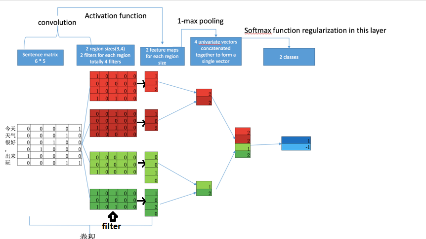

- 特点：
  - 模型简单
  - filter类似与n-gram可以提取局部特征
  - 理论上肯定要优于DNN

参考：

- [文本分类算法TextCNN原理详解（一）](https://www.cnblogs.com/ModifyRong/p/11319301.html)，还有后续代码而训练trick，好系列
- [NLP——文本分类模型（一）](https://blog.csdn.net/hei653779919/article/details/105686869 )


其他文本相关模型

- [模型统计](https://gitee.com/wangchong1119/Keras-TextClassification)


### RNN - 循环神经网络

#### 概述

- 可处理上下文依赖的任务

  - cnn的输入和输入之间是独立的，没有关联的，所以cnn不能处理上下文关联的输入，而rnn就是用来解决这类任务

- 注意：实际网络结构中只有一列$x^t$，其他列只是**不同时序时候的状态** $x^{t+1}$

  

- 两种类型：前者存hidden layer的值，后者存输出的值(更好些，比较清楚memory中是什么)

  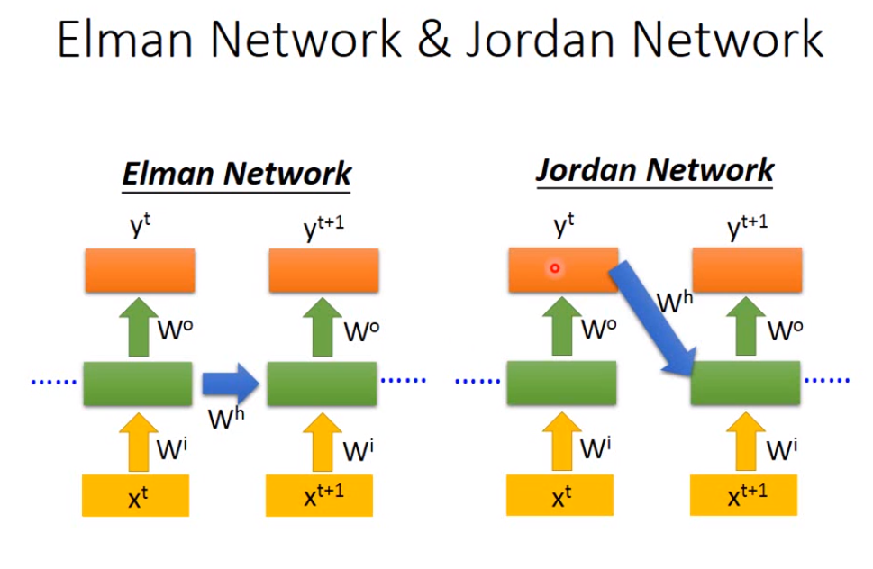

- 值传递示例：memory中存的是向量

  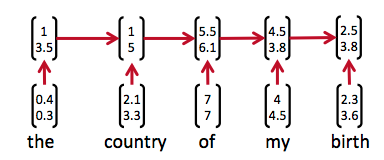

- 多层

  - 与CNN一致，每层的权重$W^0$和 $Wi$共享
  - 运算量较CNN大，比如两层下图中L33求梯度时依赖于L32、L31(注：不依赖于下层，因为各层的权重$W^0$和 $Wi$不同)

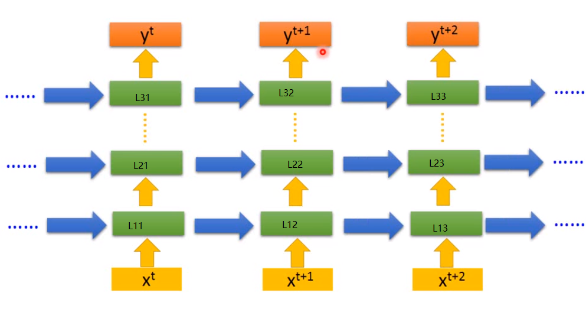

- 权重共享

  - 指的是使用模型时，在时序上对于每个输入$x^t$使用的权重参数相同
  - 训练时，权重是每次调节改变的

- RNN前向传播

  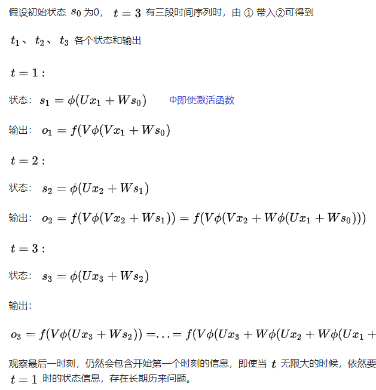

#### 问题：梯度消失 / 梯度爆炸

- 简要回答：

  - 与CNN的梯度消失不同，并不会消失，梯度总是有，**RNN 所谓梯度消失的真正含义是，梯度被近距离梯度主导，导致模型难以学到远距离的依赖关系**

  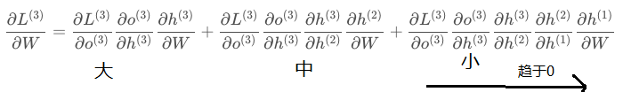

- 参考：

  - [RNN的梯度消失指的是权重停止更新吗？](https://www.zhihu.com/question/356489098/answer/900999182)
  - [RNN梯度消失与梯度爆炸的原因](https://zhuanlan.zhihu.com/p/53405950)

- 原因简述：如果使用sigmod作为激活函数，sigmod的导函数值域为(0, $1\over4$]，所以连乘后非常容易趋向于0

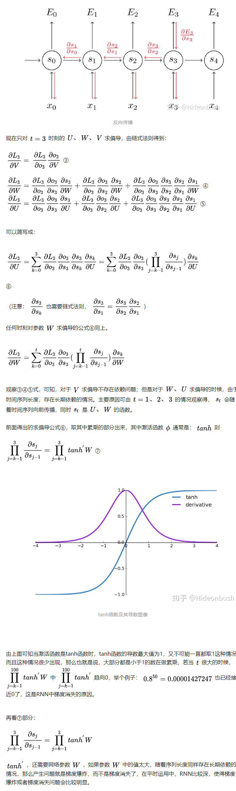

#### 长距离依赖问题

- 由梯度消失导致
- 原因分析：
  - 距离当前词越远，对当前梯度影响越小；
  - 如$S_5$对$W_0$的梯度小，$W_0$无论怎么改变都不影响$S_5$，而$W_0$是决定了如何传递$t_0$到后面，所以$t_0$对$t_5$的影响小
  - 可以直接对$t_0$求导，与$W_0$同理
- 展开成序列图（如：一个句子的每个词）
  - 如果根据最后的向量调整权值，对每个词来讲，权重矩阵不变；不同句子间是更新的
  - 如果根据每个词调整权值，对每个词来讲，权重矩阵是不同的更新过的

#### Bidirectional RNN（李宏毅-课程）

- 对于每个词，只参考了句子的前半部分而没有考虑后半部分

- Bidirectional RNN处理每个词，同时考虑了这个词前面的部分和后面的部分，即对于每个词，是考虑了整个句子后做的处理输出

  

  - 两个方向的表示进行合并

#### 使用

- 只能做监督学习

  - 比如文本分类，情感分类

  - 将句子输入rnn模型中，不生成每个词的中间序列，只要最后的向量；后面接一个dense层，输出结果

    ```python
    model = Sequential()
    model.add(Embedding(max_features, 32))
    model.add(SimpleRNN(32))	# 输出32维
    model.add(Dense(1, activation='sigmoid'))
    model.compile(optimizer='rmsprop', loss='binary_crossentropy', metrics=['acc'])
    history = model.fit(input_train, y_train, epochs=10, batch_size=128,validation_split=0.2)
    ```

  - SimpleRNN参数量：即权值矩阵U和W的参数，U(output * output) / W(output * input) + bias(output)

    - 32*32 + 32 + 32\*32 + 32 = 2080

- 无法直接根据词向量获取到句子的表示向量

  - 如句子表示向量


### LSTM & GRU

#### 概述

- 基本可以理解为LSTM就是为了解决RNN的梯度消失导致的长距离依赖问题而提出的

> LSTM其背后的长短期记忆（LSTM，long short-term memory）算法由Hochreiter
> 和Schmidhuber 在1997 年开发，是二人研究梯度消失问题的重要成果。

- 特点：
  - 解决了梯度消失问题
  - 上下文关联
  - 无法并行运算
  - 参数量是
- [框架图](https://www.zhihu.com/question/41949741/answer/318977452)
  - 注意：实际网络结构中每次只有一个输入$x^t$，其他输入只是**不同时序时的输入** $x^{t+1}$
- 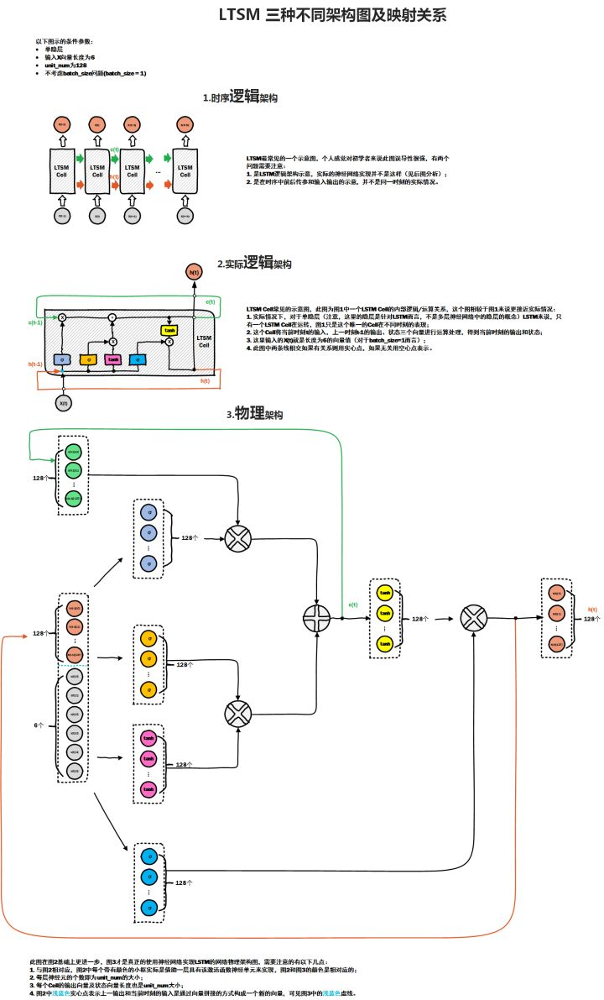

#### 原理

> 原始RNN的隐藏层只有一个状态，即h，它对于短期的输入非常敏感。那么，假如我们再增加一个状态，即c，让它来保存长期的状态，那么问题不就解决了么 
>
> 它保存信息以便后面使用，从而防止较早期的信号在处理过程中逐渐消失

- h 是隐藏状态，表示的是短期记忆； C是状态，表示的是长期记忆；x表示输入 
- lstm中的单个neural
  - input gate：控制会有$x^t$的多少进入$c^t$
  - forget gate：控制要忘记多少$c^{t-1}$
  - output gate：控制输出多少 δ ($c^t$)
- $c^t$的每次更新：此次的$c^t$由两部分组成，对已有的的$c^{t-1}$取部分(forget gate)，输入$x^t$取部分(input gate)


- 多个lstm neural连接

  - 输入：$x^t = x^t + h^{t-1} $（在现在的输入上加了上一个neural的输出作为此次输入）
  - 控制各gate的向量$Z^*$的获取：每个输入$x^t$作为DNN的输入(仅一层，全连接)，获得三个向量$z^i z^f z^o$，

  

- 可以看出每个控制gate的Z向量都和输入$x^t$有关

  - 即当前输入$x^t$会决定各gate的行为

  

- 具体细节：

  - 与rnn一样，memory（$c^t$）中是向量不是数值
  - 参考：
    - [人人都能看懂的LSTM介绍及反向传播算法推导](https://zhuanlan.zhihu.com/p/83496936)
    - [LSTM神经网络输入输出究竟是怎样的？](https://www.zhihu.com/question/41949741/answer/309529532)

  

#### 梯度问题解决

- 参考：[LSTM如何来避免梯度弥散和梯度爆炸？](https://www.zhihu.com/question/34878706/answer/665429718)

- 反向传播路径

> **LSTM 中梯度的传播有很多条路径**，![[公式]](https://www.zhihu.com/equation?tex=c_%7Bt-1%7D+%5Crightarrow+c_t+%3D+f_t%5Codot+c_%7Bt-1%7D+%2B+i_t+%5Codot+%5Chat%7Bc_t%7D) 这条路径上只有逐元素相乘和相加的操作，梯度流最稳定；但是其他路径（例如 ![[公式]](https://www.zhihu.com/equation?tex=c_%7Bt-1%7D+%5Crightarrow+h_%7Bt-1%7D+%5Crightarrow+i_t+%5Crightarrow+c_t) ）上梯度流与普通 RNN 类似，照样会发生相同的权重矩阵反复连乘。 

- 稳定的路径解决了梯度消失问题

> 但是在**其他路径**上，LSTM 的梯度流和普通 RNN 没有太大区别，依然会爆炸或者消失。由于总的远距离梯度 = 各条路径的远距离梯度之和，即便其他远距离路径梯度消失了，只要保证有一条远距离路径（就是上面说的那条高速公路）梯度不消失，总的远距离梯度就不会消失（正常梯度 + 消失梯度 = 正常梯度）。因此 LSTM 通过改善**一条路径**上的梯度问题拯救了**总体的远距离梯度**。

- 不能解决梯度爆炸问题，但可以缓解

  > 同样，因为总的远距离梯度 = 各条路径的远距离梯度之和，高速公路上梯度流比较稳定，但其他路径上梯度有可能爆炸，此时总的远距离梯度 = 正常梯度 + 爆炸梯度 = 爆炸梯度，因此 **LSTM 仍然有可能发生梯度爆炸**。不过，由于 LSTM 的其他路径非常崎岖，和普通 RNN 相比多经过了很多次激活函数（导数都小于 1），因此 **LSTM 发生梯度爆炸的频率要低得多**。实践中梯度爆炸一般通过梯度裁剪来解决。


#### 双向LSTM

- 使用

  ```python
  model = Sequential()
  model.add(layers.Embedding(max_features, 32))
  model.add(layers.Bidirectional(layers.LSTM(32)))
  model.add(layers.Dense(1, activation='sigmoid'))
  model.compile(optimizer='rmsprop', loss='binary_crossentropy', metrics=['acc'])
  history = model.fit(x_train, y_train, epochs=10, batch_size=128, validation_split=0.2)
  ```

  - 两个方向的表示合并


#### TODO 直观上的改变

- $C^t$所带来的改变不是很清晰，因为memory的更新方式与RNN差别不大，都是将现有memory值与input相加，只是增加gate来控制更新进多少input；新增了上一个的输出加入当前的输入作为输入
- 所说的保存远距离信息体现在哪里？

TODO [lstm解析：Written Memories: Understanding, Deriving and Extending the LSTM](https://r2rt.com/written-memories-understanding-deriving-and-extending-the-lstm.html#recurrent-neural-networks)


#### 使用

- 现阶段还是将其视为解决了梯度消失的RNN模型，neural内部变复杂

  ```python
  from keras.layers import LSTM
  model = Sequential()
  model.add(Embedding(max_features, 32))
  model.add(LSTM(32))		# 输出32维
  model.add(Dense(1, activation='sigmoid'))
  ```

  - 参数数量：4 * (output * input) + bias = 4*(32+32)\*32 + 4\*32 = 8320


Encoder-Decoder模型

- [参考](https://www.datalearner.com/blog/1051552962185617 )


RNN & LSTM案例

- 文本分类，有标签
- 温度预测，没有标签，根据已有数据构造出标签（输入前n个数据，第n+1个作为标签）


### 残差网络（resNet）

- 用于处理多层网络退化问题
  - 理论上层数越多，表现为在训练时，loss先下降，在多个epoch后loss又增加

>需要注意，网络退化问题不是过拟合导致的，即便在模型训练过程中，同样的训练轮次下，退化的网络也比稍浅层的网络的训练错误更高 

- 参考
  - [深度学习笔记（七）--ResNet（残差网络）](https://blog.csdn.net/qq_29893385/article/details/81207203)（非常简洁易懂，来自吴恩达的课程）

    

### encoder-decoder

- encoder：将输入编码（rnn/ lstm）
- decoder：将编码后生成的向量交给下游任务，生成目标结果
- encode的参数会随着任务训练而更新


### RNN encoder-decoder

- 概述

- 直接将encoder对句子的编码结果作为decoder的状态信息，用于表示输入上下文信息

  

- 理解：

  - RNN可以单独做任务，
  - 也可以仅做编码
  - 做编码时，类似于word2vec，但word2vec其实是实现了一个语言模型，这里会根据任务目标结果做调节，获得的编码是和任务更加相关的；后面的RNN-decoder才是实际做下游任务的，但依赖于encoder获得的编码结果；这样的好处是抽离出与任务关系不大的编码组件，而将结果交给下游的不同任务

- 结构：

  - 前部分为encoder，后部分为decoder
  - encoder和decoder都是RNN

  

- encoder将句子语义向量传给decoder

  - decoder相当于初始状态确定了的encoder(encoder初始状态为0)

参考

- [神经机器翻译（seq2seq RNN）实现详解](https://www.cnblogs.com/DjangoBlog/p/10857408.html)


### Contextualized RNN

#### 概述

- 解决simple RNN远距离依赖问题，即encoder的编码结果也会在远处逐渐消失

- 对decoder的每次输入都加上encoder的编码结果

  

#### 参考

- [【经典精读】Transformer模型深度解读 - 潘小小的文章 - 知乎](https://zhuanlan.zhihu.com/p/104393915)


### Elmo

#### 概述

- 根据句子动态的产生词向量，解决一词多义的问题

- 对于双向，每个词的左右向量拼接产生词的向量；最终的词向量，取各层词向量的权重和

- 目的是词向量，而不是句向量

- 采用了预训练的模式

  - 整体分两步：语言模型预训练，完成目标任务
  - elmo的预训练表明好的特征可以有较大的提升

- 没有采用attention，而采用了lstm，所以特征提取还不是最好的；之后的bert就是用attention来提取特征

- 结构上由两层双向lstm组成

  

依然存在的问题

- 虽然是双向的，但两部分是独立训练的；即在训练左边lstm时，只看了句子的左部分，而不是整个句子
- rnn的问题，无法并行化

#### 与word2vec比较

- 无法对于一个数据集生成其中词的向量，只能输入句子获取句子中的词向量
- rnn/lstm也是如此

#### 与bert比较

- elmo是预训练的，与word2vec一样依然是用来产生词向量的，只不过会结合上下文信息生成词向量
  - 用生成的词向量再接后面自定义的网络
- bert也是预训练，也会训练embedding层，但最后输出是句子的向量表示或句子对的向量表示
  - 不仅学了字符级、词级的特征，还学了句子级甚至句间关系的特征 
  - 所以后面仅需接一个很简单的任务层即可（一层dense）
- [如何评价 BERT 模型？ - 夕小瑶的回答 - 知乎](https://www.zhihu.com/question/298203515/answer/516904100)

> 为每个NLP任务去深度定制泛化能力极差的复杂模型结构其实是非常不明智的(Elmo+任务网络)，走偏了方向的。既然ELMo相比word2vec会有这么大的提升，这就说明**预训练模型的潜力远不止为下游任务提供一份精准的词向量**，所以我们可不可以直接预训练一个龙骨级的模型呢？如果它里面已经充分的描述了字符级、词级、句子级甚至句间关系的特征，那么在不同的NLP任务中，只需要去为任务定制一个非常轻量级的输出层（比如一个单层MLP）就好了，毕竟模型骨架都已经做好了嘛
>
> 真正体现出BERT这个模型是龙骨级模型而不再是词向量的，就是其到各个下游任务的接口设计了，或者换个更洋气的词叫迁移策略。 首先，既然句子和句子对的上层表示都得到了，那么当然对于文本分类任务和文本匹配任务（文本匹配其实也是一种文本分类任务，只不过输入是文本对）来说，只需要用得到的表示（即encoder在[CLS]词位的顶层输出）加上一层MLP就好了呀


### attention

#### 概述

- 解决Contextualized RNN对于不同的词没有侧重点的问题
- 利用了人的注意力机制，从大量文本中提取关键信息，而忽略无关信息（q用来对各输入打分）
- 用于处理特别长的句子，每个词是参考了全部文本信息的，而不是局部
- 解决了RNN无法并行处理的问题
- 多head，多注意力，提取不同的关注信息

- 大致

  


#### self-attention

- $a^i = Wx^i$（词嵌入）
- $a^i$分别乘权重矩阵$W^q ，W^k ，W^v$得到q-v-k（W是训练获得的）
- $x^1$ 的q和各个k做计算获取各∝ 


- 各∝ 与v做运算，并求和，得到b向量

  

- $x^2$类似

  

整理为矩阵运算

- $K^T Q=A$

  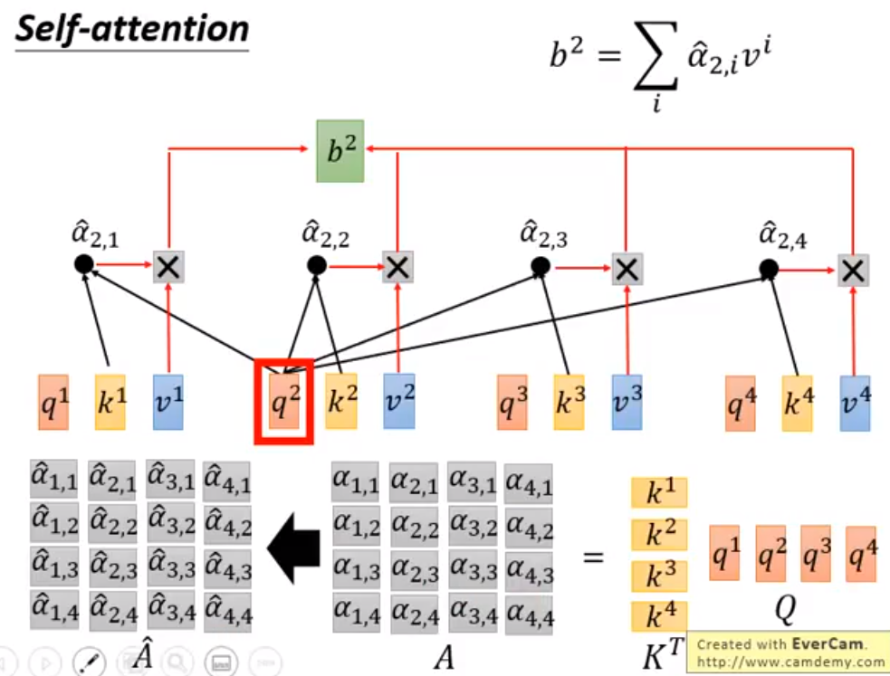

- $VA=O$

  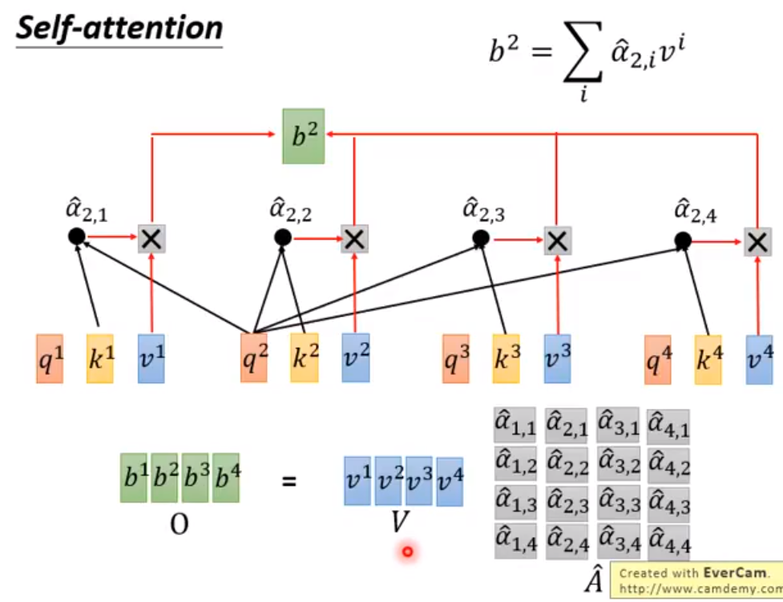

- 整体过程

  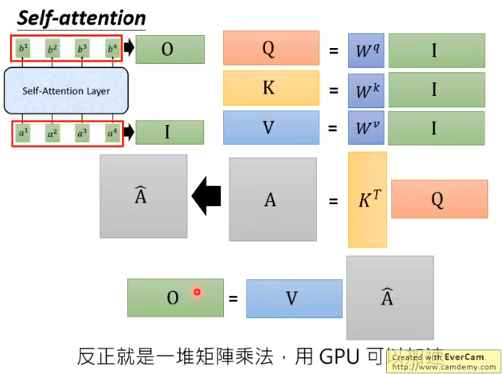

多head，相当于分为两部分：各个head分开计算

- head1

  

- head2

  

- 各自计算的结果加权求和

  

加入位置信息


- 参考
  - [Attention机制详解（二）——Self-Attention与Transformer ](https://zhuanlan.zhihu.com/p/47282410)


####  attention的种类-应用

- [Attention用于NLP的一些小结 - susht的文章 - 知乎](https://zhuanlan.zhihu.com/p/35739040)


### Transformer

#### 概述

- 分为encoder和decoder
  - encoder，用于获取每个词向量，这word2vec的不同，包含了上下文信息和注意力信息
    - 6个attention层组成
  - decoder，根据获得的词向量来执行下游任务

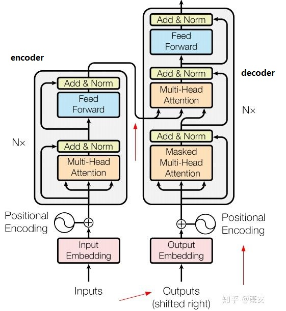

- 演示

  

#### input编码

- 使用Word2Vec等词嵌入方法将输入语料转化成特征向量（论文中使用的词嵌入的维度为512）

#### encoder

##### 结构

- encoder分为6层，每一层的构成

  

- self-attention和两个前馈全连接层组成（第一层激活函数relu，第二层线性）


- 具体
  - 输入序列，输出各序列的向量组成的矩阵


##### self-attention见上面

##### feed forward

- 全连接有两层，第一层的激活函数是ReLU，第二层是一个线性激活函数，可以表示为

$$
z_1 = max(W_1z_0 + b_1)  ---(W_1为第一层的权重矩阵，z_0为self-attention的输出向量)\\
z_2 = W_2z_1 + b_2---(W_2为第二层的权重矩阵，z_2即为encoder的输出)
$$

- 每个token是独立的dense层，所以输出维度保持不变

#### decoder

- 分为mask attention和encode-decode attention

  

##### mask attention

- mask的原因：是因为每次输入都只是预测获得的部分语句，所以要把后面的词置为0（使得$e^x$为0）
- 输出已预测的部分句子的编码（即attention的输出）

##### encode-decode attention：

- 输入k和v是由encoder的输出获得的，表示了原语句的编码（k=Wz 其中z是encoder的输出，W是训练获得）
- 这个attention的用途：用翻译出来的部分语句去匹配原语句，以预测下一个词
- 注：k和z是固定不变的，即encoder输入到decoder的句子编码是不变的


#### 参考

- [详解Transformer （Attention Is All You Need） - 大师兄的文章 - 知乎 ](https://zhuanlan.zhihu.com/p/48508221)
- [Attention机制详解（二）——Self-Attention与Transformer - 川陀学者的文章 - 知乎](https://zhuanlan.zhihu.com/p/47282410)
- [【经典精读】Transformer模型深度解读](https://zhuanlan.zhihu.com/p/104393915)
- [decoder理解 bilibili视频](https://www.bilibili.com/video/BV1jv41167M2?p=1 )
- [图示详解BERT模型的输入与输出](https://www.cnblogs.com/gczr/p/11785930.html)


### Bert

#### 概述

- 使用了transformer来提取特征
- 本质就是transformer的encoder的叠加
- 可用模型
  - BERT Base:12层transformer(attention)，12个attention heads和1.1亿个参数 
  - BERT Large:24层transformer(attention)，16个attention heads和3.4亿个参数

#### 结构

- 模型中的transformer指的仅是其encoder

- 下图中每一层的Trm仅是一个head，而不是一层有多个transformer

  

#### bert的双向

- 其实没什么特别的，特直观上的语言模型没差别，与cbow一样，不过上下文词是除了要预测词以外的所有词

- 即用mask实现双向语言模型：随机将15%的输入mask，即可实现双向语言模型，即实现类似cbow的效果

- 与gpt的单向attention mask对比

  > **小  明  喜  欢  [MASK]  度  学  习 。**
  >
  > 这句话输入到模型中，[MASK]通过**attention**均结合了左右上下文的信息，**这体现了双向**。
  >
  > **attention**是双向的，但GPT通过attention mask达到**单向**，即：让[MASK]看不到 度 学 习这三个字，只看到上文 小 明 喜 欢 


#### 参数计算

- embedding层
  - 词向量矩阵：vocab_size * hidden_size
  - 句子位置矩阵：type_vocab_size * hidden_size
  - 位置参数：max_position_embeddings * hidden_size
- attention层
  - head
    - 12个head，每个head输出64维，每个词的各head拼接得到768
    - 单个head：获取query/key/value的参数矩阵W1/W2/W3，768*3\*3768/12
    - 12个head的总参数：768*768\*3
  - 所有头拼接之后又做了线性变换（每个位置的词的参数矩阵共享）
    - 768*768
  - 共：768*768\*4
- feed-forward层
  - 第一层输出：768*4，参数量768\*768\*4
  - 第二层输出：768，参数量768\*4*768
  - 共：768\*768\*8
- 一层transformer：attention + feed-forward层
  - 768\*768\*12 = 700 w
- 总计：上面是一个transformer的参数，BERT Base有12层transformer
  - 768\*768\*12\*12 = 0.84 亿
  - head有12个
  - transformer有12层
- 参考：
  - [Bert/Transformer模型的参数大小计算](https://blog.csdn.net/weixin_43922901/article/details/102602557)


参考：

- [NLP的游戏规则从此改写？从word2vec, ELMo到BERT - 夕小瑶的文章 - 知乎](https://zhuanlan.zhihu.com/p/47488095)
- [图解 BERT 模型：从零开始构建 BERT](https://flashgene.com/archives/20062.html)
- [从Word Embedding到Bert模型—自然语言处理中的预训练技术发展史 - 张俊林的文章 - 知乎](https://zhuanlan.zhihu.com/p/49271699)
- [理解BERT：一个突破性NLP框架的综合指南](https://www.jiqizhixin.com/articles/2019-11-05-2 )
- [BERT---容易被忽视的细节 - 南方的仔的文章 - 知乎](https://zhuanlan.zhihu.com/p/69351731)


### DSSM

- 

### Esim


### Albert

- 与bert相比，参数显著下降，但acc基本保持不变
  - 减少参数量方法
    - embedding因式分解，将词嵌入参数从 O(V × H) 降低到 O(V × E + E × H) 
    - 各层参数共享
    - 句间连贯性损失(sop)，*句子顺序预测，正样本=正常顺序的2个相邻句子，负样本=调换顺序的2个相邻句子* 

- 参数量对比

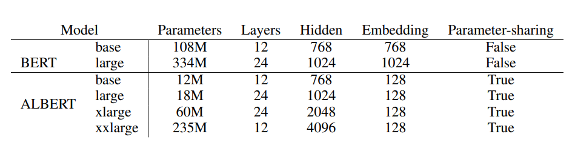


### 问题

1.nlp在神经网络中的过程不可被理解

- 是一个黑盒模型


