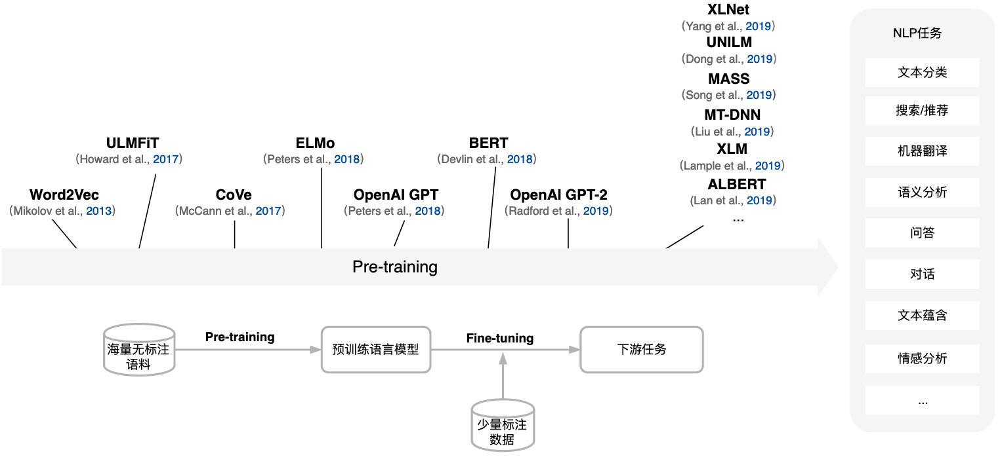
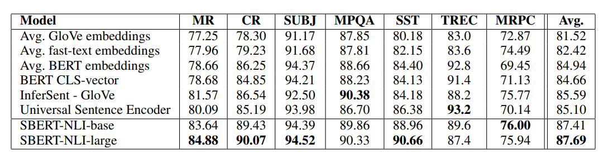

- [美团BERT的探索和实践](https://tech.meituan.com/2019/11/14/nlp-bert-practice.html)
- 

word2vec和bert是类似的

词向量是word2vec的副产物，bert也会训练embedding

word2vec的任务是语言模型，bert也是语言模型

word2vec的中间层是上下文的向量表示（直接相加各词向量求平均），最后输出的是分类

bert除了embedding的每一层都有cls表示句向量，最后输出的也是cls向量，接dense层做任务

word2vec更像是，用语言模型训练词向量，而用不到输出

从数据的角度，bert学习了这些数据，体现在参数上

对句子特征的提取，是通过网络实现的，网络是无法理解的

rnn应该用双向而不是单向，目的不是提取句子的特征向量，而是词的特征向量

elmo也是

后续的任务，基于提取的词向量，对任务数据训练

如何提取词特征？

原理是根据语言模型

rnn/elmo是根据语言模型对特征提取，word2vec也是

特征的提取取决于网络，word2vec的网络是双层DNN，elmo是双层lstm，lstm优于dnn

attention优于lstm

语言模型都要接dense做分类

利用语言模型训练的模型output是什么，怎么用

dssm/esim/bert句子对模型，与rnn/esim不是同一类型的模型

只是rnn/attention是公用的特征提取结构

各模型实现的语言模型算法不同

word2vec是最简单的，单向的，且是n-gram的，如：用前5个词预测第6个词，做分类

elmo，前后向量做交叉熵，最小化

bert，mask即完形填空，做分类

接下游任务：

elmo，预训练的是各层权重，预测时使用权重相加作为任务的输入

bert，预训练的是各个参数，预测时使用各更新的参数产生输出，主要是使用最后一层的任务相关的dense层

bert在任务上是与elmo一致的，要理解bert也只能从比较不同来得出：

- bert使用特征抽取更好的attention
- 参数量更多，训练数据更多
- 以至于，只需要接一层dense既可以处理不同的任务

esim和albert表现相近，但应该没有bert高

- 召回需要的是离线句向量
  - bert没有提供句向量，即并不知道取哪几层，权重又是多少
  - elmo提供了词向量，但有开源的预训练词向量可以用（腾讯词向量）
  - 所以还是用esim做召回，或者是更优的双塔模型产生句向量，但目前esim就已经够好了
- 排序
  - TODO 

> ELMo这种使用预训练语言模型的词向量作为特征输入到下游目标任务中，被称为Feature-based方法。
>
> (美团BERT的探索和实践) 

》基于词向量搭建网络做任务，和预训练型模型做任务，可以对两者进行对比

[nlp中使用预训练的词向量和随机初始化的词向量的区别在哪里？](https://www.zhihu.com/question/324943987)

句向量

- 训练任务，用dssm/esim获取句向量，但这类模型无法预训练
- bert，bert-as-service开源项目中使用了倒数第二层
  - 因为最后一层的太接近任务（语言模型和next sentence任务）
  - 而前面层的特征提取的不够
  - 另外，词向量也是取倒数第二层

是否要用预训练的词向量？

即，使用在大规模语料上预训练的词向量是否能有效提升效果

--可能提升并不大，但能加快拟合速度，是在已提取的特征上去拟合任务

> ELMo能否比word2vec好以及好多少，和实际任务的关系可能很大 
>
> 一部分已经在中文实验（甚至生产环境）上取得了很好的结果，一部分则说ELMo没效果。 

参考：

- [在中文语料中，ELMo比word2vec好很多么？](https://www.zhihu.com/question/288565744)

》InferSent

除了语言模型训练出来的词向量，即word2vec

还有用监督学习获取词向量的模型，[InferSent——有监督的语句嵌入模型](https://blog.csdn.net/cpluss/article/details/81460657)

》Sentence-BERT

只用预训练的字向量，感觉提升不大

预训练没有体现出来，可以用双塔bert来训练，预训任务采用bert的nsp

相关论文：[Sentence-BERT: 一种能快速计算句子相似度的孪生网络](https://www.cnblogs.com/gczr/p/12874409.html)

》fine-tuning bert

[BERT模型可以使用无监督的方法做文本相似度任务吗？ - 驯猫师的回答 - 知乎](https://www.zhihu.com/question/354129879/answer/886821182)

但这个答主的实验结论是，sentence-bert比基于embedding的方法好，但由于缺少句子级的交互，所以差于fine-tuning后的bert

- 所以，召回，有条件可以上sentence-bert，没条件就esim
- 排序，用监督数据fine-tuning后的bert

答主也提到了，有些情况下直接对预训练的词向量求平均已经可以work了，所以思路可以转变一下，不一定非得用神经网络，也可以用传统的一些方法类实现

- 前面3个是直接对句子的词向量求平均（不过需要注意的是，这些词向量相当于是预训练的词向量）

[BERT模型可以使用无监督的方法做文本相似度任务吗？ - 包大人的回答 - 知乎](https://www.zhihu.com/question/354129879/answer/1015466495)

- 这个答主直接指出了关键，用不用bert，就看有没有监督数据了，有就用，没有就不用

》预训练的词向量应该如何使用

测试训练的字向量对表现的影响-esim（注意：测试的是字向量，而不是词向量）

- 没有提升

之前也测过dssm的

> padding-0对应的是0向量，即词向量矩阵的索引0位置是0向量：66%
> padding-0对应的是某个字的向量，即词向量矩阵的索引0位置不是0向量：也可以达到66%，但收敛速度变慢
> 把句子的embedding词向量弄错：65%
> ---直观的理解：所以embedding不是那么重要，如果使用错误的embedding，则初始偏离更大一些，后面的网络也能调整过来

所以单独使用词向量，意义不大，还是要和任务一起训练才会好些

即先预训练，再在任务上训练，就像elmo，最后输入任务中的是各层加权后的词向量

