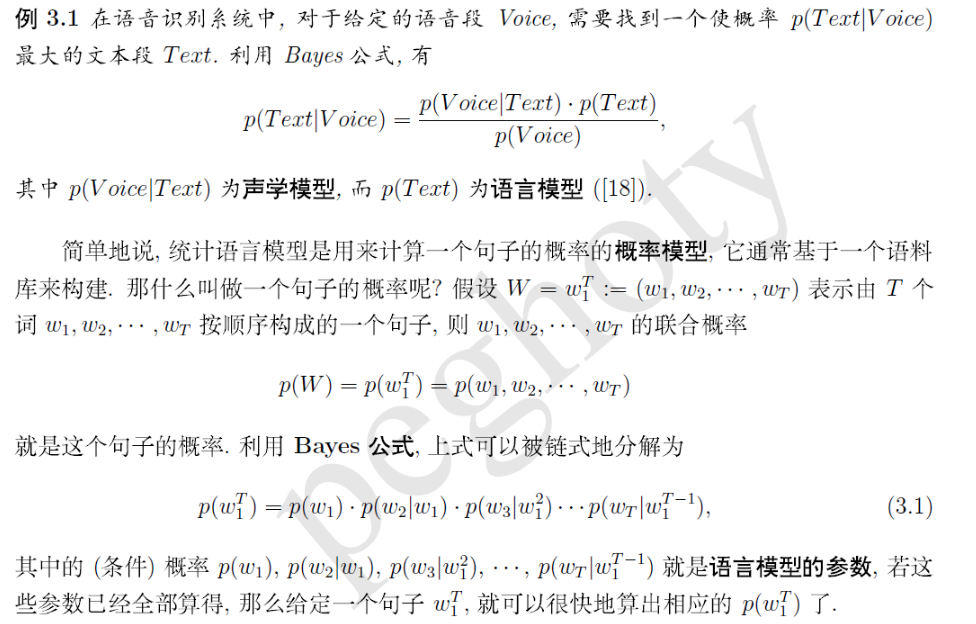
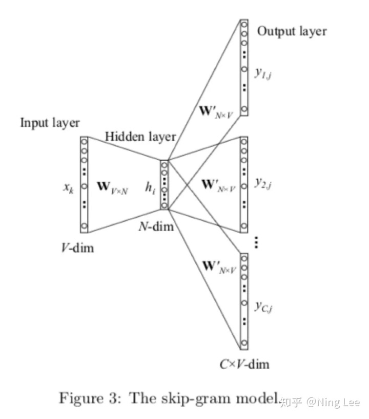
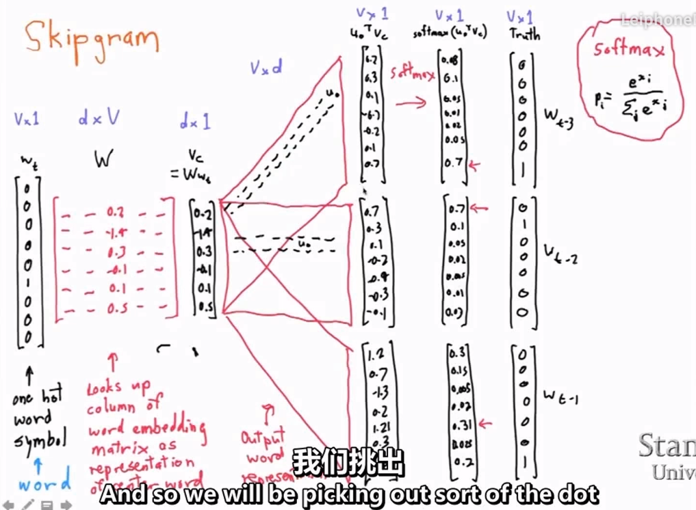

概述

- nnlm（neural network language model），就是word2vec，glov等

### 传统语言模型 & n-gram

- 即根据语料计算出静态的短语出现概率，保存起来，之后需要计算句子概率时，找到相关的概率，连乘即可
- 问题：计算量巨大，无法动态扩展
- 解决计算量问题：n-gram
  - 利用马尔可夫过程（每个状态的转移只依赖于之前的n个状态）
- n-gram问题：本质还是静态计算概率，而不是用向量表示出来，无法基于词向量做后续的逻辑

### word2vec - 词向量

#### 前置对比：one-hot

- 表示稀疏，没有表现出词与词之间的关联

#### word2vec原理

$$
目标函数：max \prod_{w\subset C}^{} p(w|Context(w)) \\
与中心词的one-hot做交叉熵作为loss函数，进行参数调整
$$

- 目标函数是一个最大似然估计，最终获取一个参数矩阵，即可根据词的one-hot获取其词向量
- 准备训练数据，是一条条语句；可以获取所有的词汇字典
- 根据上下文词语获取词汇字典中的所有词的概率
- 训练时，输入是遍历所有上下文，输出词汇字典中为各词的概率，与实际的语句数据进行对比
- 训练完成后，网络中的权重矩阵即可生成词向量

#### 特点

- 本质还是基于语言模型，只不过用neural network来计算
- 上下文相似的词的词义是相同的
- 训练完成后网络知道给定“狗”最可能出现的“跑”，第二可能出现的“叫”，即“狗”与“跑”最近，“叫”的距离次之，而且“跑”出现的次数越多，离“跑”越近
- 优点：
  - 与one-hot对比，考虑了词之间的关联性
- 缺点：
  - 依然是静态的，即每个词对应一个向量，除非重新训练一次
  - 考虑频率不考虑词的位置，即没有参考语序信息
  - TODO **每个词只对应固定的一个词向量，无法解决多义词的问题**
- 只有正向的反馈，没有负反馈，给定两个词只能知道有多么“相关”，而不知道有多“不相关”（解决方法：negative sampling）

[word2vec，特点总结 - 张云的文章 - 知乎](https://zhuanlan.zhihu.com/p/29364112)

#### 两种训练方式

- cbow：训练时输入根据上下文，预测中心词（上面说的就是这个）

  - 问题：上下文词语在hidden layer中是相加的

- skip-gram：输入一个词，预测其上下文词汇

  - [注意：下图不是实际的网络模型！！](https://zhuanlan.zhihu.com/p/65633189)

  - 实际的网络模型，对于一个中心词每次仅输出一个上下文词汇

  - 在更新完一个中心词的一个上下文词汇后，W/W'会改变，所以y2j会与y1j有轻微的改变，就有了后面的那张图

    

  

	​	

- 参看：

  - [word2vec 中的数学原理详解](https://www.cnblogs.com/peghoty/p/3857839.html)（必看）

  - [秒懂词向量Word2vec的本质 - 穆文的文章 - 知乎 ](https://zhuanlan.zhihu.com/p/26306795 )
  - [word2vec是如何得到词向量的？ - crystalajj的回答 - 知乎](https://www.zhihu.com/question/44832436/answer/266068967)

根据数据集生成模型

[Python gensim库word2vec 基本用法](https://www.cnblogs.com/Allen-rg/p/10589035.html)

[中文word2vec的python实现](https://blog.csdn.net/sinat_29694963/article/details/79177832 )

[文本分类实战（一）—— word2vec预训练词向量](https://www.cnblogs.com/jiangxinyang/p/10207273.html)

[python-word2vec模块使用详解](https://blog.csdn.net/qq_28840013/article/details/89681499 )

