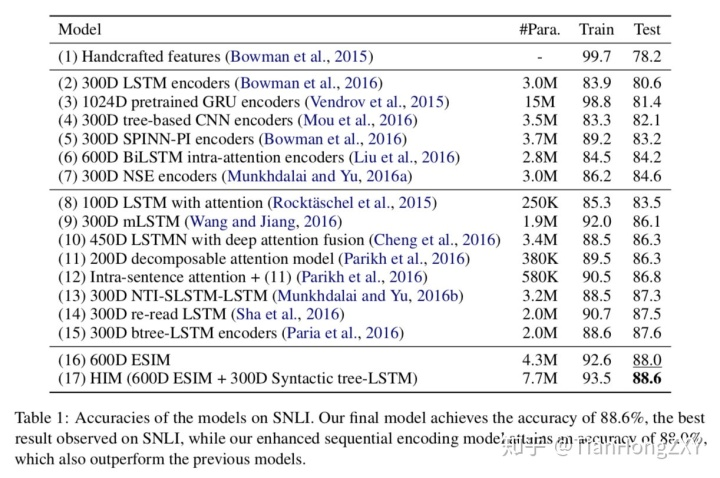

### 文本匹配概述参考

[谈谈文本匹配和多轮检索 - 莫冉的文章 - 知乎](https://zhuanlan.zhihu.com/p/111769969)

[文本匹配相关方向打卡点总结 - 夕小瑶的文章 - 知乎](https://zhuanlan.zhihu.com/p/87384188)

[贝壳找房【深度语义匹配模型 】原理篇二：交互篇](https://www.6aiq.com/article/1589798723495)

[【文本匹配】概述](https://blog.csdn.net/guofei_fly/article/details/107477501 )

文本匹配模型合集：https://terrifyzhao.github.io/2019/05/13/文本匹配模型合集.html

Text_Matching：https://github.com/JepsonWong/Text_Matching

深度文本匹配综述.pdf

## 背景

[谈谈文本匹配和多轮检索 - 莫冉的文章 - 知乎](https://zhuanlan.zhihu.com/p/111769969)

#### 机器学习

> 传统的文本匹配任务还是采用 基于特征的方式 ，无非就是抽取两个文本tf-idf、BM25、词法等层面的特征，然后使用传统的机器学习模型（LR，SVM）等进行训练。虽然基于特征的方法可解释性较好，但是这种依赖于人工寻找特征和不断试错的方法，泛化能力就显得比较一般，而且由于特征数量的限制，导致参数量受到限制，模型的性能比较一般。 

#### 深度学习

> 2012年以来，深度学习技术的快速发展以及GPU的出现，使得人们有机会并且有能力训练大型的深度神经网络。深度学习技术开始对计算机视觉、自然语言处理等各个领域产生了冲击，作为自然语言处理的一个分支，文本匹配当然也不例外。2013年，微软提出 DSSM (2013)，率先将深度学习技术引入到了文本检索任务中，开启了文本匹配方向的深度学习时代。 

分为两类

> 不同于传统基于特征的匹配方式，深度学习时代的文本匹配方法可以概括为两种类型： 基于表征（representation）的匹配和基于交互（interaction）的匹配 方式。 

##### 表示型

> 所谓基于表征的匹配方式，初始阶段对两个文本各自单独处理，通过深层的神经网络进行编码，得到文本的表征，然后基于得到的文本表征，采用相似度计算的函数得到两个文本的相似度。  

- [【第九期】AI Talk：深度文本匹配在智能客服中的应用 - AI Talk的文章 - 知乎](https://zhuanlan.zhihu.com/p/47336836)

> 最早将深度学习应用于文本匹配的是微软 Redmond 研究院。
>
> 2013年微软 Redmond 研究院发表了 DSSM [2]，当时 DSSM 在真实数据集上的效果超过了SOTA(State of the Art)；
>
> 为了弥补 DSSM 会丢失上下文的问题，2014年微软又设计了CDSSM [3]；
>
> 2016年又相继发表了 DSSM-LSTM， MV-DSSM。
>
> 微软的 DSSM 及相关系列模型是深度文本匹配模型中比较有影响力的，据了解百度、微信和阿里的搜索场景中都有使用。其他比较有影响的模型有：2014年华为诺亚方舟实验室提出的 ARC-I和ARC-II [4]，2015年斯坦福的 Tree-LSTM [5]，2016年 IBM 的 ABCNN [6]，中科院的 MatchPyramid [7]，2017年朱晓丹的 ESIM[8]，2018 年腾讯 MIG 的多信道信息交叉模型 MIX [9]。

- then

> 之后，还有一些基于表征的匹配方法，包括孪生网络Siamese Network (2016)以及其变种，但是在2017年之后基本就没有基于表征的模型出现了。

##### 交互型 

- attention阶段

  > 要想能够建模文本各个层级的匹配关系，最好能够尽早地让文本产生交互。通俗来讲就是，认识的越早，两个文本对彼此的了解就可能越多；
  >
  > 这种思路就是首先通过attention为代表的结构来对两段文本进行不同粒度的交互（词级、短语级等），然后将各个粒度的匹配结果通过一种结构来聚合起来，作为一个超级特征向量进而得到最终的匹配关系。 

- transformer阶段

  > 随着[Transformer (2017)](https://link.zhihu.com/?target=https%3A//arxiv.org/pdf/1706.03762.pdf)的出现，self Attention和multi-head Attention成了香饽饽，也成了后面很多模型默认采用的Attention策略 

- bert阶段

  > 2018年年底，[BERT (2018)](https://link.zhihu.com/?target=https%3A//arxiv.org/pdf/1810.04805.pdf)横空出世，预训练模型开始主导NLP战场，各个方向的SOTA几乎都被BERT刷了个遍，文本匹配自然也不例外

- next

  > 综上所述，BERT以及其衍生出来的预训练模型基本上统治了当下文本匹配数据集的SOTA榜单，相信未来会有更好的文本匹配模型对BERT形成冲击，但是可以预见的是BERT的统治还将持续相当一段时间，毕竟更容易上手。 

[文本匹配相关方向打卡点总结](https://www.jiqizhixin.com/articles/2019-10-18-14)

> 虽然基于表示的文本匹配方法（一般为Siamese网络结构）与基于交互的匹配方法（一般使用花式的attention完成交互）纷争数年，不过最终文本匹配问题还是被BERT及其后辈们终结了。

## 表示型-交互型

### 1.表示型

#### 概述

- 表示型匹配模型的代表算法有： DSSM、CDSSM, MV-LSTM, ARC-I, CNTN, CA-RNN, MultiGranCNN 等
- 优点
  - 简单有效
- 缺点：
  - 依赖于词向量，而词向量一般仅是根据语言模型获得
  - 得到的句子表示失去语义焦点，容易发生语义偏移，词的上下文重要性难以衡量；表征用来表示文本的高层语义特征，但是文本中单词的关系、句法的特征高层的表征比较难捕获，很难判定一个表征是否能很好的表征一段文本。
  - 对两个待匹配文本都是独立处理
- 进行提升

> 其实，基于表征的方式可创新的地方并不多，Embedding层是固定的，Encoding层无非再加上各种char-embedding，或者entity-embedding来引入先验知识；可以稍微有点创新的就只有DNN层，但是由于表征模型从头到尾对两个待匹配文本都是独立处理的，能做的只能是怎么得到更好的表征向量，很容易想到的就是把DNN替换为RNN型网络或者后来的Attention网络；Prediction层则是寻找不同的相似度计算函数，或者直接使用一层线性层代替。 

- 参考：
  - [贝壳找房【深度语义匹配模型 】原理篇一：表示型](https://www.6aiq.com/article/1589474365961)

#### 模型

- 用来做召回，如推荐系统中计算出用户和商品的向量，保存起来，直接计算
- 召回后，在进模型精排

##### DSSM(2013)

- deep semantic structured model，多塔模型

- 对embedding做全连接

  

##### CDSSM

- convolutional deep semantic structured model
- 将全连接换成CNN

##### LSTM DSSM

- 将全连接换成LSTM

##### siamese网络

- 概念的提出非常早，见论文：[Signature Verification Using a Siamese Time Delay Neural Network](https://papers.nips.cc/paper/769-signature-verification-using-a-siamese-time-delay-neural-network.pdf )

- 和dssm是类似的，只是仅有两个塔，做两个文本的相似度比较
- 与DSSM对应的模型：Siamese Network ，SiameseCNN 
  - SiameseLSTM（2016）
    - 论文：[Siamese Recurrent Architectures for Learning Sentence Similarity](https://link.zhihu.com/?target=http%3A//www.mit.edu/~jonasm/info/MuellerThyagarajan_AAAI16.pdf) 

> SiamCNN的提出者针对表示型文本匹配模型的两个核心步骤，分别对比了大量的CNN双塔模型方案以及相似性计算的方法，得出最优结果
>
> 在CNN双塔模型方案中，共对比了如下6种方案 
>
> 文本向量相似度的计算中，共对比了如下9种方案 
>
> 最佳模型：q-a采用共享的Hidden-Layer（MLP+tanh激活函数）+ 共享的CNN + 1-D最大池化
>
> 相似度计算方法：GESD和AESD更好

参考

- [【文本匹配】表示型模型](https://blog.csdn.net/guofei_fly/article/details/107477540 )
- [深度学习解决 NLP 问题：语义相似度计算 - 夏威廉的文章 - 知乎](https://zhuanlan.zhihu.com/p/40210422)
- [DSSM及双塔模型在推荐系统中的应用](https://www.bilibili.com/video/BV1sV41167YJ/ )

### 2.交互型

#### 概述

> 2016年之后，随着Attention机制在各个领域的的普及，如何采用花式Attention技巧来强化单词向量表征，以及文本的交互矩阵成为之后文本匹配工作的核心。 
>
> 2017年的论文[BiMPM (2017) ](https://zhuanlan.zhihu.com/p/111769969/htt%3C/b%3Eps://arxiv.org/pdf/1702.03814.pdf)可以说是对之前Attention的方式进行了一个汇总，也比较清晰地描述了基于交互的文本匹配模型的范式
>
> 2017年的论文[ESIM (2017)](https://link.zhihu.com/?target=https%3A//arxiv.org/pdf/1609.06038.pdf)也是文本匹配方向比较重要的一篇论文，笔者也是通过这篇论文第一次了解了Cross Attention。 	

- 可能的缺点

   > [不过个人经验来说](https://zhuanlan.zhihu.com/p/87384188)，这种思路下虽然可以玩的花样很多，一些论文argue的点也看似有一些道理，不过实际很多模型都是在廖廖一两个数据集上疯(暴)狂(力)改(搜)进(索)各种structure才把分数刷上去的，导致这种structure看似在某个场景甚至仅仅是某些数据集上work，实际上这个structure可能仅仅迎合了特定数据分布或特定场景的一些特性，导致很多工作放到一个新场景下就效果翻车了，甚至努力调参都调不动太多。 
   >
   > 因此在BERT之前这类论文提出的模型虽然看起来高大上，不过可能换个数据集后还不如稍微调调参拍拍脑袋的SiameseCNN好用。 

- 交互型匹配模型的代表算法有： ARC-II、MatchPyramid、DeepMatch、ESIM、ABCNN、BIMPM、BIIN、DRCN 等

   -  attention之前
      -  忽略
   -  attention
      -  DecAtt、ESIM、ABCNN、BIMPM

   

- 参考

  -  [谈谈文本匹配和多轮检索](https://zhuanlan.zhihu.com/p/111769969)
  - [贝壳找房【深度语义匹配模型】原理篇二：交互篇](https://www.6aiq.com/article/1589798723495)

#### 模型

##### ESIM(2017.4)

> ESIM是ACL2017的一篇论文，在当时成为各个NLP比赛的杀器 
>
> ESIM是一个很简单高效的文本匹配baseline了，各种数据集上都比较work 

- 结构：embedding + BiLSTM + attention + BiLSTM + pooling + Dense

  

- acc参考(来自论文中)

  

- 参考：

  - [自然语言推理入门：ESIM](https://blog.csdn.net/qq_40367479/article/details/105924564 )
  - [短文本匹配的利器-ESIM - 简枫的文章 - 知乎](https://zhuanlan.zhihu.com/p/47580077)

##### ABCNN(2018.6)

- Attention-Based Convolutional Neural Network for Modeling Sentence Pairs 

- 基于BCNN（ basic (non-attention) CNN that is based on the Siamese architecture ），加入了attention

- bcnn结构

  

- abcnn结构

  

- 参考

  - [文本匹配模型之ABCNN](https://terrifyzhao.github.io/2019/05/13/文本匹配模型之ABCNN.html )

##### 综述型

[BiMPM](https://arxiv.org/pdf/1702.03814.pdf ) (2017.7)

- Bilateral Multi-Perspective Matching for Natural Language Sentences 
- acc主要和Siamese对比

> 可以说是对之前Attention的方式进行了一个汇总，也比较清晰地描述了基于交互的文本匹配模型的范式

[Neural Network Models for](https://arxiv.org/pdf/1806.04330.pdf)（2018.8）

- Neural Network Models for Paraphrase Identification, Semantic Textual Similarity, Natural Language Inference, and Question Answering 
- acc主要和Esim对比

### 3.预训练型

- bert
- albert

各模型对比

> 其中HCAN是EMNLP2019新提出的模型(论文采用了花式Attention和Pooling策略 )，虽然已经吊打了ESIM、DecAtt等老一代花哨模型，但是可以看到还是被BERT吊打了，更不必说跟XLNet、ERNIE2.0和RoBERTa等近期模型去对比了。所以**真正大一统文本匹配任务的话，目前来看还是离不开大型预训练模型的。** 

- [博主个人比较](https://terrifyzhao.github.io/2019/05/13/文本匹配模型合集.html)

  

## 多轮QA检索

概述

- 对话与问答比较相似
- 不过问答仅涉及一个问题，而问答往往要结合之前的好几次提问来做出回答，即会有需要推理的场景

模型：

> [Multi-view (2016)](https://link.zhihu.com/?target=https%3A//www.aclweb.org/anthology/D16-1036.pdf) 
>
> 2017年出现了多轮QA领域比较有代表性的论文[SMN (2017)](https://link.zhihu.com/?target=https%3A//arxiv.org/pdf/1612.01627.pdf) 
>
> 2018年，出现了多篇对SMN改进的论文。[DUA (2018)](https://link.zhihu.com/?target=https%3A//arxiv.org/pdf/1806.09102.pdf) 
>
> [MSN (2019)](https://link.zhihu.com/?target=https%3A//www.aclweb.org/anthology/D19-1011.pdf)是目前多轮QA的SOTA模型 
>
> 多轮检索目前和预训练模型结合的探索还比较少 

## 落地

参考案例：[第三届魔镜杯大赛各队实现 ](https://ai.ppdai.com/mirror/goToMirrorDetail?mirrorId=1 )

- 表示型和交互型中各选一个进行实现
- 理论上交互型应该效果会好些

